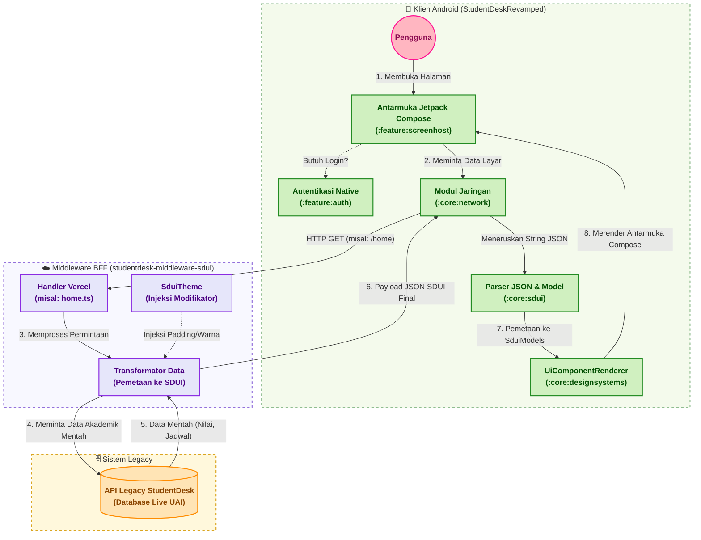

# Student Desk Revamped (Android Client)

> **Important Note:** This repository is the Android Client portion of a two-part system. It relies heavily on a dedicated middleware/Backend-For-Frontend (BFF) to function correctly. Without the corresponding BFF, this client will not be able to fetch UI configurations or data.

Student Desk Revamped is a modern, dynamic Android application built using a **Server-Driven UI (SDUI)** architecture. This approach allows the application's screens, layout, and content to be rendered dynamically based on JSON responses from the middleware, reducing the need for frequent app updates for UI changes.



## Key Technologies & Architecture

*   **100% Kotlin:** The entire codebase is written in Kotlin, leveraging its concise syntax and modern language features.
*   **Jetpack Compose:** The UI layer is built completely with Jetpack Compose, Android's modern toolkit for building native UI. Compose pairs perfectly with SDUI due to its declarative nature.
*   **Server-Driven UI (SDUI):** The core architectural pattern. The app fetches a UI schema from the backend and dynamically translates it into Compose UI components at runtime.
*   **Modularization:** The project is structured into distinct Gradle modules for better separation of concerns, build speed optimization, and potential feature reusability:
    *   `:app`: The main application module.
    *   `:core:sdui`: The engine responsible for parsing server responses and rendering the dynamic UI.
    *   `:core:designsystems`: Contains the foundational UI components, theme definitions, and styling used across the app (and by the SDUI engine).
    *   `:core:network`: Handles API communication with the BFF.
    *   `:feature:screenhost`: A generic host responsible for loading and displaying SDUI-driven screens.
    *   `:feature:auth`: Handles authentication flows.
    *   `:feature:onboarding`: Manages the new user onboarding experience.

## ⚙️ How it Works (SDUI Architecture)

1.  **Request:** The Android client requests a specific screen (e.g., "Home", "Profile") from the BFF.
2.  **Response:** The BFF returns a JSON payload describing the UI structure (components, modifiers, data, and actions).
3.  **Parsing & Rendering:** The `:core:sdui` module parses this JSON and maps the abstract components to concrete Jetpack Compose composables defined in `:core:designsystems`.
4.  **Display:** The dynamically constructed UI is presented to the user.

## 🛠️ Setup & Execution

### Prerequisites

*   Android Studio (latest stable version recommended).
*   JDK 17+.
*   A running instance of the corresponding Middleware/BFF.

### Getting Started

1.  **Clone the repository:**
    ```bash
    git clone <repository_url>
    ```
2.  **Open in Android Studio:** Open the cloned directory in Android Studio.
3.  **Configure API Endpoint:** Ensure the app points to the correct BFF endpoint. This is typically configured in a `local.properties` file or build configuration (refer to the `core:network` module for specific setup instructions).
4.  **Build and Run:** Select your target device or emulator and click "Run" in Android Studio.

## 🤝 Contributing

When contributing to this repository, please keep the SDUI architecture in mind. 
*   **UI Components:** If a new UI element is needed, it must be added to `:core:designsystems` and a corresponding parser must be implemented in `:core:sdui` so the backend can utilize it.
*   **Business Logic:** Most complex business logic should reside in the BFF. The Android client should primarily focus on rendering the UI state provided by the server and handling local user interactions before forwarding them to the BFF.

## 📄 License

This project is licensed under the Apache License 2.0 - see the [LICENSE](LICENSE) file for details.
